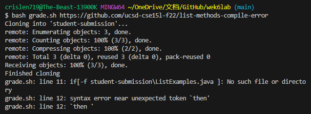
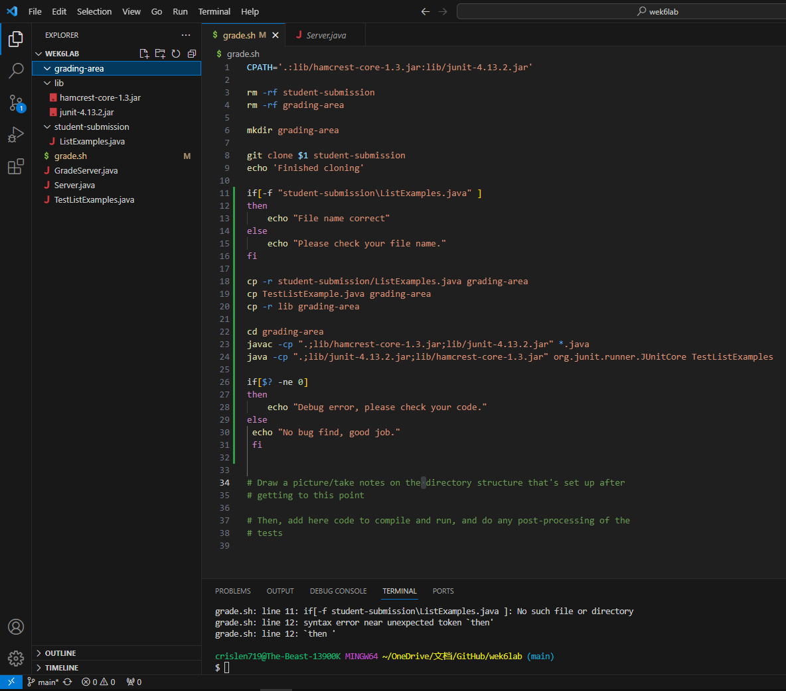

###Part1 - Debugging Scenario
1) Orginal post from a student
   Hi, I having trouble with my week 6 lab to make a grading script. In my terminal, it shows that after running line 8 to git clone
   student-submission and line 9 to print echo mission, in line when I try to check if the student submission file name is correct, it shows No such file
   or directory, in line 12 there is a syntax error. I tried to change my directory for checking student submissions but it didn't fix the problem,
   can you check my code please?  
   
   Screenshot of terminal: 
     

    Screenshot of code and files:  
      
    
    
