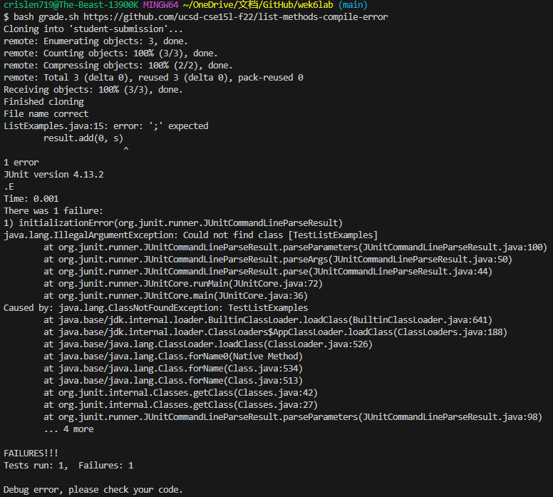
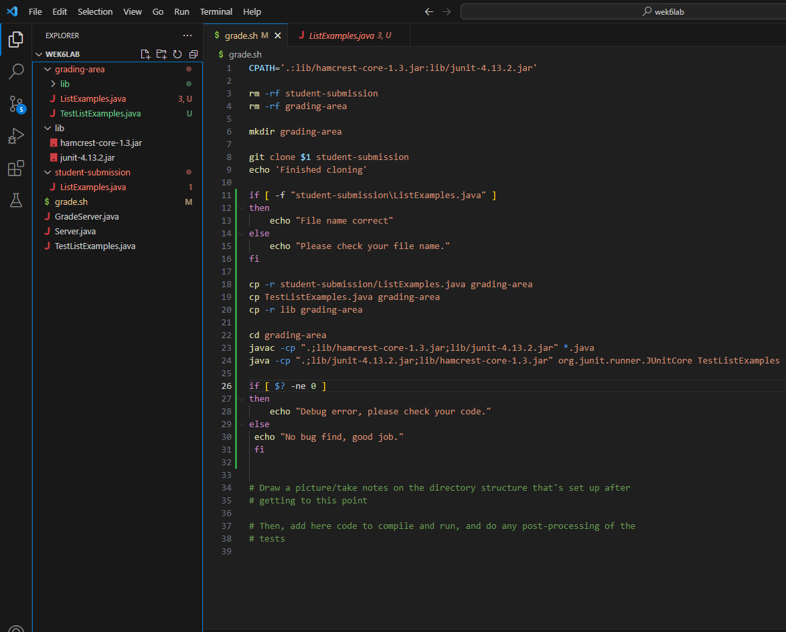

### Part1 - Debugging Scenario
1) Orginal post from a student
   Hi, I having trouble with my week 6 lab to make a grading script. In my terminal, it shows that after running line 8 to git clone
   student-submission and line 9 to print echo mission, in line when I try to check if the student submission file name is correct, it shows No such file
   or directory, in line 12 there is a syntax error. I tried to change my directory for checking student submissions but it didn't fix the problem,
   can you check my code please?  
   
   Screenshot of terminal: 
     

    Screenshot of code and files:  
      
    
2) TA response
       Hello. By taking a look at your code, I am pretty sure you have no problem with your directory in line 11. But please check your format when you do the if else statement in line 11 and line 26, it will fix your problem.
3) Student feedback
   Hello, Thank you for answering. I found out there are some problems with my if else format. I didn't type space after type if in lines 11 and 26 causing the problem. After I fixed my if-else statement format, the terminal showed a command not found in line 26, but later I found there was a format error for [$? -ne 0], and it should be [ $? -ne 0]. Now my code is running well and all problem is solved, I will be careful with the coding format in the future.  

   Screenshot of the terminal:  
     

   Screenshot of the code and files after fixed:  
     

### Part2 Reflection
I would say the vim and jdb are some cool things I learned. In vim, we can do things just using a keyboard with no mouse, and in jdb we can stop the code in a line you want to test if your code has any bug. We may not use this two so often but is interesting to know.
